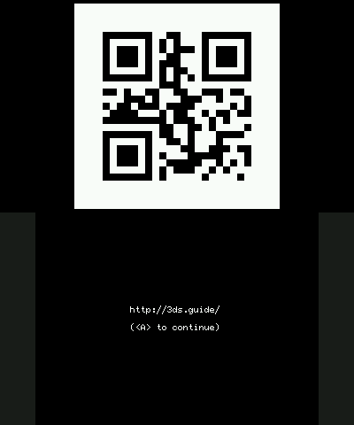

# QR3DS

This [GodMode9][] script allows you to generate QR Codes with your 3DS.

## Usage

0. Move the `qrgen.gm9` script to `gm9/scripts/`
1. Boot into [GodMode9][] (`START` + `POWER`)
2. Press the `HOME`-Button
3. Navigate to `Scripts...`
4. Run `qrgen`

[GodMode9]: https://github.com/d0k3/GodMode9/
